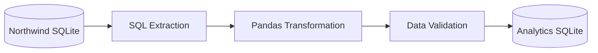

# Northwind Sales ETL Pipeline

[](https://github.com/josecarpalaciosr/northwind-sales-etl-pipeline/actions/workflows/ci.yml)

A local batch ETL pipeline that extracts Northwind sales data from SQLite, transforms and validates 609,283 sales order lines using Python, SQL, and Pandas, and loads the results into an analytical SQLite database.

## Project Status

The core ETL pipeline is complete and covered by automated tests.

- ✅ Sales data extraction
- ✅ Data cleaning and financial transformations
- ✅ Structural and business-rule validation
- ✅ Analytical SQLite database loading
- ✅ Automated tests with pytest
- ✅ Structured application logging
- ✅ Continuous integration with GitHub Actions
- ✅ Project documentation
- ✅ Reusable analytical SQL queries
- ✅ Automated analytical integration and semantic tests
- 📋 Power BI dashboard planned
- 📋 Docker and PostgreSQL migration planned

## Project Overview

This project demonstrates a complete local batch ETL workflow using the Northwind transactional database as its source. The pipeline converts operational sales records into a clean, validated, and query-ready analytical dataset.

The workflow extracts sales order lines with SQL, transforms and enriches them with Pandas, applies structural and business-rule validations, and performs a full-refresh load into a separate analytical SQLite database. Automated tests, structured logging, and continuous integration support reliability and maintainability.

## Pipeline Architecture



## Transformation Logic

The transformation stage cleans source fields and creates analytical attributes without modifying the original extracted DataFrame.

| Transformation | Purpose |
|---|---|
| Convert ISO 8601 date strings to Pandas datetime values | Enable reliable date filtering, grouping, and time-based analysis |
| Replace missing customer countries with `Unknown` | Preserve sales records while assigning an explicit analytical category |
| Remove surrounding spaces from employee names | Standardize inconsistent source text |
| Create `EmployeeFullName` | Provide a reporting-friendly employee attribute |
| Calculate financial metrics | Produce gross revenue, discount amount, and net revenue for every sales line |

The financial metrics are calculated as follows:

- `GrossRevenue = UnitPrice × Quantity`
- `DiscountAmount = GrossRevenue × Discount`
- `NetRevenue = GrossRevenue − DiscountAmount`

All monetary results are rounded to two decimal places.

## Analytical SQL Layer

The processed `sales_order_lines` table supports a collection of reusable analytical SQL queries stored in `sql/analytics/`.

| Query | Business purpose | Main SQL concepts |
|---|---|---|
| `monthly_sales_performance.sql` | Analyze monthly revenue trends and month-over-month growth | CTEs, aggregation, `LAG()`, window functions |
| `product_performance.sql` | Compare product revenue, category contribution, and product rankings | Partitioned window functions, `DENSE_RANK()` |
| `country_performance.sql` | Measure customer-country revenue, average order value, and global contribution | Distinct counts, global window calculations, ranking |
| `employee_performance.sql` | Evaluate employee sales, average order value, and on-time shipment performance | Multi-level aggregation, conditional aggregation, ranking |
| `discount_performance.sql` | Compare revenue and effective discount rates across discount bands | `CASE`, conditional grouping, global revenue share |

The queries operate on the validated analytical table rather than directly on the transactional Northwind schema. This separates the ETL process from the reporting layer and provides consistent business-ready metrics for downstream tools such as Power BI.

The analytical queries include:

- Monthly gross, discount, and net revenue.
- Month-over-month net revenue growth.
- Product rankings within categories and across the complete catalog.
- Country-level revenue contribution and average order value.
- Employee revenue and on-time shipment performance.
- Discount-band utilization, effective rates, and revenue contribution.

## Data Quality Validation

The pipeline validates transformed data before loading it into the analytical database.

| Validation rule | Reason |
|---|---|
| Dataset must not be empty | Prevent loading an unusable analytical table |
| Required columns must exist | Confirm that the expected schema was produced |
| Required values must not be null | Prevent incomplete identifiers and financial calculations |
| `OrderID` and `ProductID` must be unique together | Preserve one record per original sales order line |
| Quantity must be greater than zero | Reject sales lines without a valid sold quantity |
| Unit price must not be negative | Prevent impossible historical prices |
| Discount must be between 0 and 1 | Confirm that discounts are valid proportions |
| Financial metrics must match recalculated values | Detect incorrect revenue or discount calculations |

The validation stage raises a descriptive `ValueError` immediately when a rule fails, preventing invalid data from reaching the analytical database.

## Technology Stack

| Technology | Role in the project |
|---|---|
| Python 3.11+ | ETL orchestration and application logic |
| Pandas | Data extraction results, transformations, and validation |
| SQL | Relational extraction and analytical database objects |
| SQLite | Transactional source and analytical target databases |
| pytest | Automated testing of transformation, validation, loading, and analytical SQL |
| Python logging | Pipeline execution records and error traceability |
| GitHub Actions | Continuous integration across supported Python versions |
| Git and GitHub | Version control, feature branches, and pull-request workflow |

## Project Structure

```text
northwind-sales-etl-pipeline/
├── .github/
│   └── workflows/
│       └── ci.yml
├── data/
│   ├── processed/
│   └── raw/
│       └── northwind.db
├── docs/
│   ├── NORTHWIND_SQLITE_LICENSE.txt
│   └── source_erd.md
├── logs/
├── reports/
│   └── figures/
├── sql/
│   ├── analytics/
│   │   ├── country_performance.sql
│   │   ├── discount_performance.sql
│   │   ├── employee_performance.sql
│   │   ├── monthly_sales_performance.sql
│   │   └── product_performance.sql
│   └── extraction/
│       └── sales_order_lines.sql
├── src/
│   └── northwind_etl/
│       ├── __init__.py
│       ├── extract.py
│       ├── inspect_database.py
│       ├── load.py
│       ├── logging_config.py
│       ├── pipeline.py
│       ├── transform.py
│       └── validate.py
├── tests/
│   ├── test_analytics.py
│   ├── test_load.py
│   ├── test_transform.py
│   └── test_validate.py
├── .gitignore
├── pyproject.toml
└── README.md
```

- `.github/workflows/ci.yml`: runs the automated test suite with GitHub Actions.
- `data/raw/`: contains the original Northwind SQLite database.
- `data/processed/`: receives the analytical database generated by the pipeline.
- `docs/`: contains the source database license and entity-relationship documentation.
- `logs/`: receives generated pipeline execution logs.
- `reports/figures/`: is reserved for generated analytical visualizations.
- `sql/extraction/`: contains SQL used to extract transactional sales data.
- `sql/analytics/`: contains reusable business-oriented SQL queries for monthly, product, country, employee, and discount analysis.
- `src/northwind_etl/`: contains the installable ETL package.
- `tests/`: contains unit, integration, and semantic tests for the ETL pipeline and analytical SQL layer.

## Installation

### Prerequisites

- Python 3.11 or later
- Git

### Clone the repository

```bash
git clone https://github.com/josecarpalaciosr/northwind-sales-etl-pipeline.git
cd northwind-sales-etl-pipeline
```

### Create and activate a virtual environment

Windows PowerShell:

```powershell
python -m venv .venv
.\.venv\Scripts\Activate.ps1
```

macOS or Linux:

```bash
python3 -m venv .venv
source .venv/bin/activate
```

### Install the project

```bash
python -m pip install --upgrade pip
python -m pip install -e ".[dev]"
```

The `dev` optional dependency group installs pytest in addition to the runtime dependencies.

## Running the Pipeline

Run the complete ETL pipeline from the repository root:

```bash
python -m northwind_etl.pipeline
```

The command performs the following operations:

1. Verifies that the source database exists.
2. Extracts sales order lines with SQL.
3. Transforms dates, customer countries, employee names, and financial metrics.
4. Confirms that transformation preserved the original row count.
5. Validates structural, business, and financial rules.
6. Loads the validated data into the analytical SQLite database.
7. Records execution details in the terminal and log file.

Generated outputs:

- Analytical database: `data/processed/northwind_analytics.db`
- Execution log: `logs/pipeline.log`

## Automated Testing

The project includes 26 automated tests covering successful behavior and expected failure conditions across the transformation, validation, load, and analytical SQL stages. The analytical SQL tests confirm that every query executes successfully, preserves its expected output schema, and satisfies key business invariants such as revenue shares totaling approximately 100%, rankings starting at one, valid percentage ranges, and correct month-over-month calculations.

| Stage | Tests | Main coverage |
|---|---:|---|
| Analytics | 10 | Query execution, output schemas, monthly growth, revenue shares, rankings, percentage ranges, and discount consistency |
| Transform | 5 | Date conversion, missing-country handling, employee-name cleaning, financial calculations, and preservation of the original DataFrame |
| Validate | 9 | Valid data, empty datasets, missing columns, null values, duplicates, invalid quantities, negative prices, invalid discounts, and inconsistent revenue |
| Load | 2 | Analytical table and index creation, plus repeatable full-refresh loading |
| **Total** | **26** | ETL and analytical SQL validation |

Run the complete test suite with:

```bash
python -m pytest -v
```

The transformation and validation tests use small representative DataFrames so that individual rules can be verified quickly and independently. Load tests use temporary SQLite databases managed by pytest, preventing automated tests from modifying the real analytical database. Analytical integration and semantic tests build a temporary analytical database from the source data, execute the actual SQL files against it, and validate their output structure and principal business rules.

## Logging

The pipeline uses Python's standard logging library to record execution progress and failures.

Logs are written to both:

- The terminal for immediate execution feedback.
- `logs/pipeline.log` for persistent local troubleshooting.

The default logging level is `INFO`, which records pipeline stages and dataset dimensions. Detailed previews can use `DEBUG`, while unexpected failures are recorded with their traceback before being raised again.

## Continuous Integration

GitHub Actions automatically runs the complete test suite in clean Ubuntu environments using:

- Python 3.11, the minimum supported version.
- Python 3.14, the current development version.

The workflow runs when:

- A pull request targets `main`.
- Changes are pushed or merged into `main`.
- A user starts it manually with `workflow_dispatch`.

This verifies that the project can be installed and tested outside the developer's local environment. The workflow configuration is stored in `.github/workflows/ci.yml`.

## Data Source

The project uses a SQLite version of the Northwind sample database stored at `data/raw/northwind.db`. Keeping the source database in the repository makes the ETL pipeline reproducible without requiring an external database server.

Additional source documentation:

- [Source database entity-relationship diagram](docs/source_erd.md)
- [Northwind SQLite license information](docs/NORTHWIND_SQLITE_LICENSE.txt)

## Pipeline Results

A successful pipeline execution currently produces:

| Metric | Result |
|---|---:|
| Extracted sales order lines | 609,283 |
| Extracted columns | 23 |
| Transformed sales order lines | 609,283 |
| Transformed columns | 27 |
| Loaded analytical rows | 609,283 |
| Automated tests | 26 |
| Analytical indexes | 3 |

The unchanged row count confirms that the transformation preserves sales-line granularity. The four additional transformed columns provide cleaned employee information and calculated financial metrics for analytical use.

## Roadmap

- [x] Build the local SQLite ETL pipeline
- [x] Add structural, business, and financial validation
- [x] Add automated tests
- [x] Add structured logging
- [x] Add continuous integration
- [x] Create complete project documentation
- [x] Add analytical SQL queries
- [x] Add automated tests for the analytical SQL layer
- [ ] Build a Power BI dashboard
- [ ] Containerize the project with Docker
- [ ] Migrate the analytical database to PostgreSQL