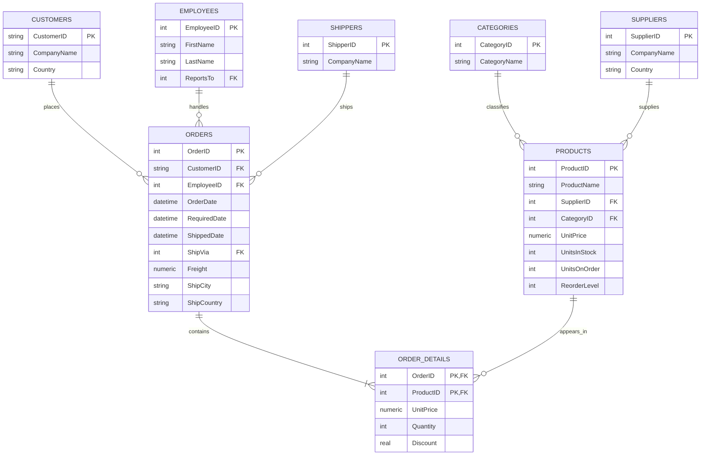
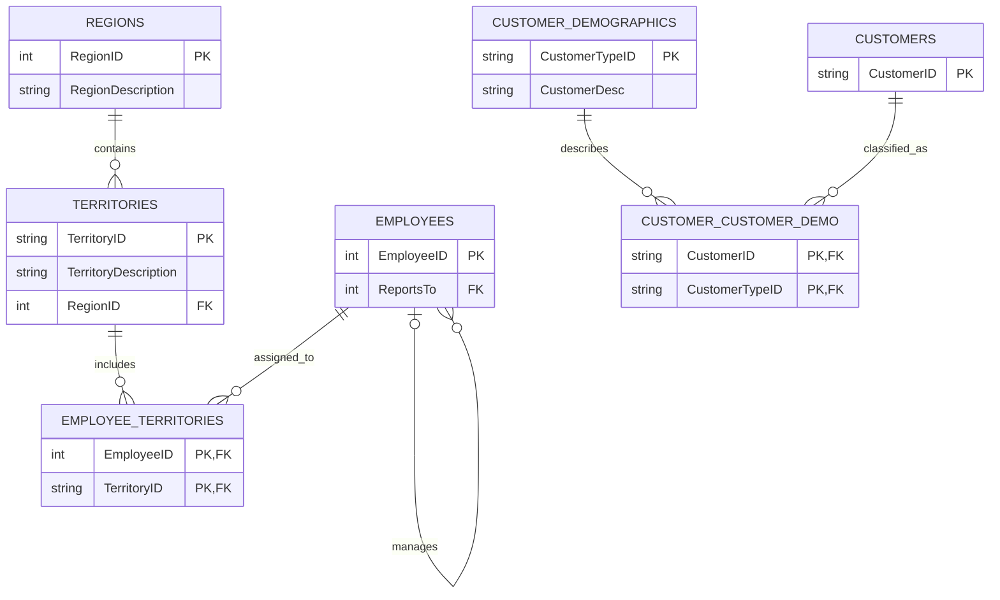

# Northwind Source Database ER Diagram

> The diagrams show the relationships and columns relevant to the initial sales ETL pipeline, not every physical column in the source database.

## Core Sales Relationships

## Supporting Relationships

The customer demographic tables currently contain no records and are not required by the initial sales ETL pipeline.