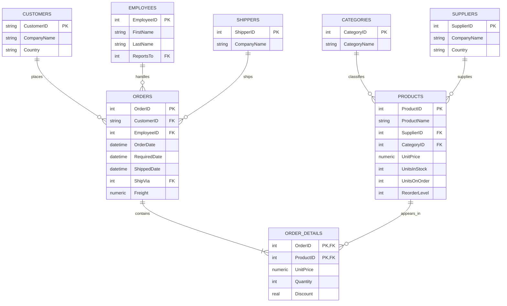
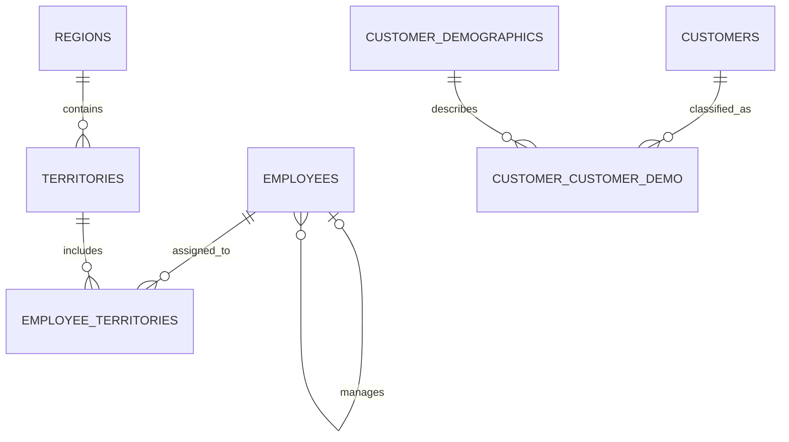

# Northwind Source Data Model

This document describes the main relationships in the operational Northwind SQLite database used as the source of the ETL pipeline.

## Core Sales Model

`ORDER_DETAILS` represents the source table named `"Order Details"` in SQLite. The underscore is used in the diagram to avoid spaces in the entity identifier.

## Supporting Relationships

The customer demographic tables currently contain no records and are not required by the initial sales ETL pipeline.

## Key Relationship Types

- One customer can place many orders.
- One employee can handle many orders.
- One shipper can deliver many orders.
- One order contains many order-detail lines.
- One product can appear in many order-detail lines.
- One category can contain many products.
- One supplier can supply many products.
- One employee can report to another employee.
- Employees and territories have a many-to-many relationship through `EmployeeTerritories`.

## ETL Relevance

The initial ETL pipeline will focus on the core sales tables:

- `Orders`
- `"Order Details"`
- `Products`
- `Categories`
- `Customers`
- `Employees`
- `Shippers`
- `Suppliers`

These relationships determine the joins, referential-integrity validations, dimensional model, and table-loading order used by the pipeline.